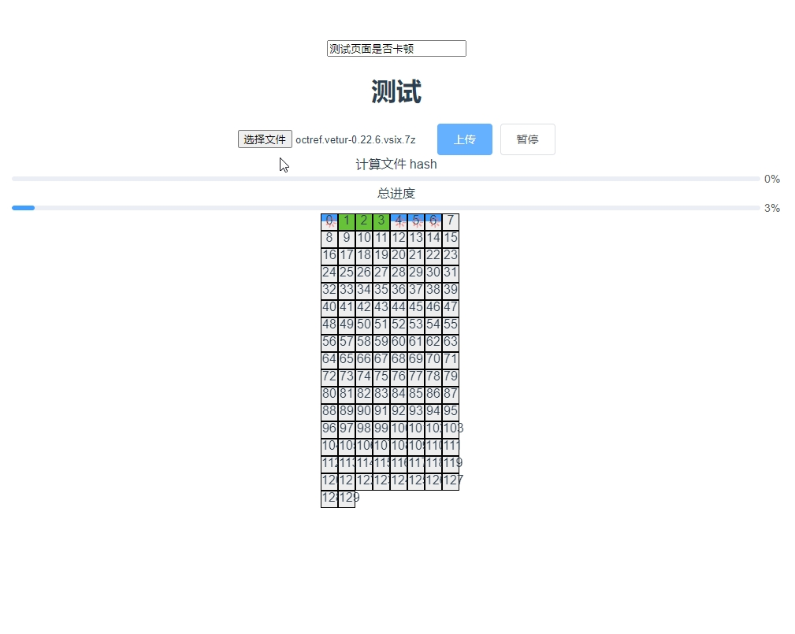

# 大文件上传 

* 文件hash值计算

    使用webworker  window.requestIdleCallback(workLoop) 抽样算法 计算文件的hash值。再计算过程中，通过切片的处理总数回传进度条

* 切片上传

    控制上传的并发数，过滤掉uploadList中的切片，拿到waiting状态的切片，发起请求，请求成功，释放占用的通道。请求失败，重新尝试，对于重试请求超过3次的，直接中断请求。

* 秒传

    上传之前向后端询问，当前文件是否存在服务器，服务器返回uploaded,uploadList(已上传的文件切片)

* 断点续传

    封装xml 将每个请求都放在数组中维护，当请求处理成功，则删除该请求。
    当发起中断时，终止正在发起的请求。当恢复时，拿出数组里的请求，再重新发起请求。

* 合并切片的请求

    当所有的切片都发送成功了，向后台发起合并请求 

* 上传模拟tcp的慢启动

   刚开始只上传一定大小的切片，计算上传消耗时间，与期待的时间如30s做对比，再次发送时，按照时间比例发送一定大小的切片
